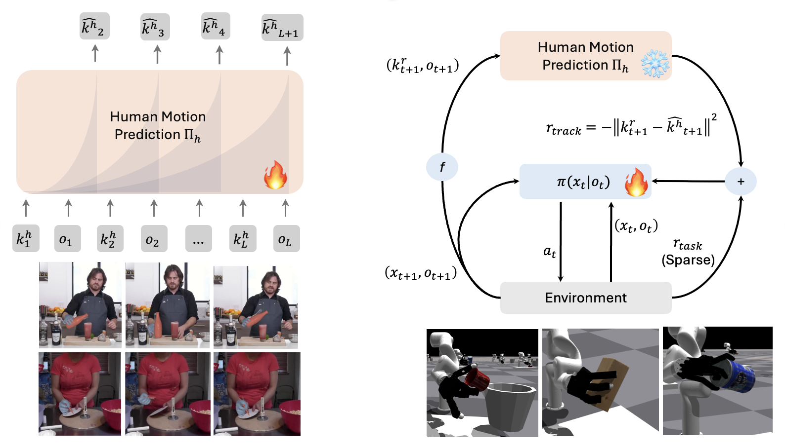

# Deep Sensorimotor control by Imitating Predictive Models of Human Motion
This repo contains code for the paper [Deep Sensorimotor control by Imitating Predictive Models of Human Motion](https://hgaurav2k.github.io/hop/pdf/manuscript.pdf)

We capture fine-grained visual understanding of human motion from videos and then use it to train sensorimotor policies. By tracking the predictions of such model, we can train robot policies that follow human behavior without depending on excessive manual reward-engineering, real2sim, kinematic retargeting, or affordance prediction.

For a more detailed overview, check out the project [webpage](https://hgaurav2k.github.io/trackr)!

  
  

  

<!-- 

  

    <video src='videos/tracks-1.mp4' width="48%" controls autoplay loop muted>
      Your browser does not support the video tag.
    </video>
    <video src='videos/tracks-2.mp4' width="48%" controls autoplay loop muted>
      Your browser does not support the video tag.
    </video>
  

  

    Our method learns robot policies by imitating predictive models of human motion trained on videos.
  

 -->

For any questions, please contact [Himanshu Gaurav Singh](https://hgaurav2k.github.io/).

## Setup

* Create conda environment using `conda env create -f rlgpu.yaml`
* Install [IsaacGym](https://developer.nvidia.com/isaac-gym) in this environment. 
* Download the [asset](https://drive.google.com/drive/folders/1BE3lg8k1kssGxojtL0OkQLscSAkbpNzS?usp=sharing) folder and put them in the root directory.  

## Running the code

### Training human motion prediction model on DexYCB

* Download the hand-object interaction dataset from [here](https://drive.google.com/file/d/1aOS66vnIh88zGHLVSdG3komFLKvm3LPq/view?usp=sharing). Extract using `unzip -r dexycb_isaacgym.zip`. Put it under the root directory. 
* Run `bash scripts/hst/train_mo.sh <DATADIR>`

### Training robot policy by using human motion as reward

* Pretrained checkpoint for human keypoint prediction can be found in `checkpoints/track_predn.pt`. You can also use your own trained checkpoint.
* For your choice of `task`, run `bash scripts/distmatch/distmatch_{task}.sh`.
<!-- 
 -->

### Visualising trained policies 

* Run `bash scripts/visualise/visualise_{task}.sh <PATH_TO_POLICY>`.

## Citation 
<ADD>

## Acknowledgment
<ADD>

